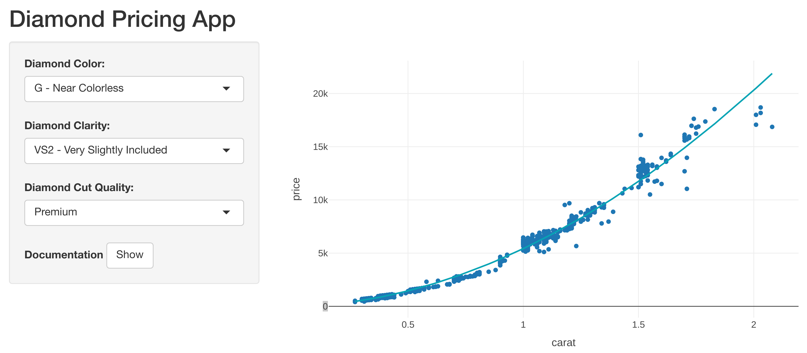

```{r setup, include=FALSE, cache=TRUE}
knitr::opts_chunk$set(echo = FALSE)
```

## Introduction

- Buying and selling diamonds is hard
- Multiple factors go into a diamond's price
- A tool to quickly price diamonds would be very useful
- Such mentioned tool would look really nice if someone implemented it as a Shiny app with R and embedded interactive plots using the respectable Plotly library

## Diamond traders, rejoice! Here is the app you have been waiting for.
```{r screenshot, echo=FALSE, out.width = '100%'}

```

## Example scatterplot code

Example price/weight scatterplot of diamonds having color E, clarity VVS2, and cut "Very Good"
```{r, message = FALSE}
library(plotly)
d <- diamonds[diamonds$color   == "E" &
              diamonds$clarity == "VVS2" &
              diamonds$cut     == "Very Good", ]

fit <- lm(log(price) ~ log(carat), d)

p <- plot_ly(d, x = ~carat, y = ~price) %>%
add_markers(x = ~carat, y = ~price, showlegend = FALSE) %>%
add_lines(y = ~exp(predict(fit)),
          line = list(color = 'rgba(7, 164, 181, 1)'),
          name = "Estimated")
```
            
## Plotly plot
Example price/weight scatterplot of diamonds having color E, clarity VVS2, and cut "Very Good"
```{r, echo = FALSE}
p
```
